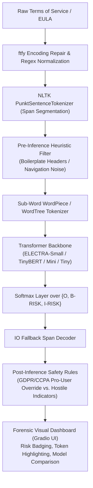

# Gotcha Clause Extractor — Project Technical Overview

- **Title:** Gotcha Clause Extractor — Legal NLP Token Classification & Fair-Contract Auditing Engine
- **Tagline / Role:** Lead NLP & Full-Stack AI Engineer
- **Description:** Terms of Service (ToS) and End-User License Agreements (EULA) are notoriously dense and frequently conceal unilateral modification rights, mandatory arbitration, class-action waivers, and invasive tracking policies. Formulated legal clause extraction as an entity sequence labeling / token-classification task using a BIO tagging scheme (`O`, `B-RISK`, `I-RISK`). Fine-tuned and systematically evaluated 4 transformer architectures (`ELECTRA-Small`, `TinyBERT`, `BERT-Mini`, `BERT-Tiny`) across a unified legal corpus (`CodeHima/TOS_Dataset` + `EE21/ToS-Summaries` + synthetic legal edge cases) optimized via Optuna Hyperparameter Optimization (HPO). Implemented class-weighted Cross-Entropy loss ($[0.38, 4.70, 1.00]$) to address severe tag sparsity and IO-fallback boundary decoding. Built deterministic preprocessing (`ftfy` encoding repair, line-wrap restoration, NLTK sentence span segmentation) and domain-specific post-processing heuristics (boiler-plate header suppression, hostile waiver indicators, GDPR/CCPA pro-user protection). Deployed as an interactive forensic Gradio application on Hugging Face Spaces featuring live comparative multi-model inference.
- **Tech Stack / Tools:** Python 3.10, PyTorch, Hugging Face Transformers (`AutoModelForTokenClassification`), Optuna, Gradio 4.44, NLTK, ftfy, Evaluate (Seqeval), Pandas, Scikit-Learn
- **Link / Demo / Repo:** [GitHub Repository](https://github.com/Polymari/aol-nlp.git) / [Hugging Face Space Demo](https://huggingface.co/spaces/fergieee/gotcha-classifier2)

---

## 1. Problem Formulation & System Architecture

Consumer software agreements are intentionally written to maximize legal defensibility for corporations at the expense of user comprehension. Standard text classification fails because it categorizes whole documents or paragraphs, providing no granular signal on specific offending clauses. 

To solve this, the problem is framed as a **Token-Level Sequence Labeling Task** ($X \to Y$), mapping each sub-word token $x_i$ to a label $y_i \in \{ \text{O}, \text{B-RISK}, \text{I-RISK} \}$:
- **`O` (Outside):** Benign standard terms and operational legalese.
- **`B-RISK` (Beginning of Risk):** The first sub-word token introducing an unfair, unilateral, or rights-waiving stipulation.
- **`I-RISK` (Inside of Risk):** Subsequent tokens belonging to the identified risky clause.



---

## 2. Dataset Synthesis & Loss Function Engineering

### 2.1 Unified Legal Corpus
The models were trained on a synthesized and balanced legal dataset created from:
1. **`CodeHima/TOS_Dataset`:** Real-world terms from 50+ major technology platforms.
2. **`EE21/ToS-Summaries`:** Human-annotated fairness tags and extracted policy statements.
3. **Local Synthetic Legal Corpus:** Custom adversarial boundary edge cases (unilateral subscription fee updates, stealth tracking cookies, indemnification loops).

To neutralize positional inductive bias (where models memorize that risks only appear at the bottom of a contract), training samples were augmented using **Symmetric Context Mixing**, rotating clauses with benign introductory provisions while maintaining natural syntax.

### 2.2 Inverse-Square-Root Class-Weighted Loss
Legal token datasets suffer from severe class imbalance: $> 93\%$ of tokens in contracts belong to label `O`, while `B-RISK` constitutes $< 2\%$ of the total token count. Standard cross-entropy leads to degenerate models that predict `O` universally.

We applied **Inverse-Square-Root Class Weighting** in the Cross-Entropy loss:

$$w_c = \frac{1}{\sqrt{f_c}}$$

$$\mathcal{L} = -\frac{1}{N} \sum_{i=1}^N \sum_{c \in \{O, B, I\}} w_c \cdot y_{i,c} \log(\hat{y}_{i,c})$$

Normalized effective weights applied during PyTorch loss calculation:
- $w_{\text{O}} = 0.38$
- $w_{\text{B-RISK}} = 4.70$
- $w_{\text{I-RISK}} = 1.00$

By scaling $w_{\text{B-RISK}}$ by $\approx 12.4\times$ relative to $w_{\text{O}}$, the gradient update heavily penalizes missed clause boundaries.

---

## 3. Optuna Hyperparameter Optimization (HPO) & Empirical Results

Hyperparameter tuning was conducted through Optuna across 10 trials per model architecture, evaluating learning rates ($\log \text{uniform}(10^{-5}, 10^{-4})$), weight decay ($[0.001, 0.15]$), warmup ratios ($[0.05, 0.25]$), batch sizes ($\{8, 16\}$), and selective bottom-layer freezing ($0$ to $2$ layers).

### 3.1 Optimal Hyperparameters per Architecture

| Model | Frozen Layers | Learning Rate | Weight Decay | Batch Size | Warmup Ratio |
| :--- | :---: | :---: | :---: | :---: | :---: |
| **ELECTRA-Small** | 0 | $3.18 \times 10^{-5}$ | 0.0158 | 8 | 0.135 |
| **TinyBERT** | 0 | $7.72 \times 10^{-5}$ | 0.0579 | 8 | 0.222 |
| **BERT-Tiny** | 2 | $1.64 \times 10^{-5}$ | 0.1287 | 16 | 0.155 |
| **BERT-Mini** | 0 | $6.74 \times 10^{-5}$ | 0.0057 | 16 | 0.249 |

### 3.2 Hold-Out Test Set Performance

The retrained checkpoints were evaluated on an unseen held-out test split:

| Model Architecture | Parameters | Disk Size | Test F1 | Test Precision | Test Recall | Test Accuracy | Evaluation Loss |
| :--- | :---: | :---: | :---: | :---: | :---: | :---: | :---: |
| 🥇 **ELECTRA-Small (Fine-Tuned)** | **13.5M** | **51.5 MB** | **79.71%** | **72.82%** | **88.04%** | **89.33%** | 0.3734 |
| 🥈 **TinyBERT (Fine-Tuned)** | 14.3M | 54.4 MB | 77.60% | 69.49% | 87.86% | 88.36% | 0.3408 |
| 🥉 **BERT-Tiny (Fine-Tuned)** | 4.4M | 16.7 MB | 75.02% | 63.64% | **91.37%** | 69.38% | 0.6731 |
| 4. **BERT-Mini (Fine-Tuned)** | 11.1M | 42.4 MB | 68.41% | 55.61% | 88.87% | 85.79% | **0.2474** |

> **Key Finding:** `ELECTRA-Small` achieved the optimal balance of overall F1 ($79.71\%$) and accuracy ($89.33\%$). For resource-constrained edge deployments, `BERT-Tiny` delivers an outstanding $91.37\%$ recall at only $4.4\text{M}$ parameters ($16.7\text{ MB}$), ensuring virtually zero predatory clauses escape detection.

---

## 4. Pipeline & Heuristic Engineering

### 4.1 Strict BIO vs. IO Fallback Decoding
In standard NER, spans require an initial `B-RISK` tag. However, because legal clause boundary words are syntactically variable, models occasionally emit `I-RISK` on the very first sub-word token. Strict BIO decoding resulted in **0 extracted spans** on several test agreements.

We implemented **IO Fallback Decoding**:
```python
# Spans can start on either B-RISK or I-RISK, ensuring no flagged tokens are dropped
for idx, pred in enumerate(predictions):
    label = id2label[pred]
    if label in ("B-RISK", "I-RISK"):
        active_span_indices.append(idx)
```

### 4.2 Pro-User Override Safety Guard (`check_pro_user_override`)
Standard keywords like *"data collection"* or *"access"* appear in both predatory clauses and GDPR/CCPA privacy rights guarantees. To prevent false positives while ensuring malicious waivers never bypass detection, an adversarial override guard was implemented:

```python
def check_pro_user_override(sentence: str) -> bool:
    # Critical Safety Guard: Never suppress if hostile waiver terms exist
    for pattern in RE_WAIVER_HOSTILE:
        if pattern.search(sentence):
            return False

    # Suppress as benign only if it explicitly confers affirmative user rights
    if RE_USER_RIGHTS_PATTERN.search(sentence) or RE_GDPR_CCPA.search(sentence):
        return True
    return False
```

---

## 5. Directory & Artifact Structure

```
nlp_aol/
├── app.py                             # Gradio 4.44 forensic web dashboard
├── train.py                           # Optuna HPO training & evaluation suite
├── strategies.md                      # Architectural tradeoffs & strategy documentation
├── requirements.txt                   # Dependency definitions
├── environment.yml                    # Conda environment specification
├── gotcha/                            # Modular inference engine
│   ├── __init__.py                    # Public API exports
│   ├── constants.py                   # Model metadata, token maps, regex rules
│   ├── heuristics.py                  # Boilerplate filter, pro-user override
│   ├── inference.py                   # Batched neural inference & caching
│   └── preprocessor.py                # ftfy & Punkt sentence segmentation
└── gotcha-extractor-model/            # Trained weights & evaluation telemetry
    ├── electra-small/                 # Fine-tuned ELECTRA weights (.safetensors)
    ├── electra-small_metrics.json     # Full Optuna trial logs & test metrics
    ├── tinybert/                      # Fine-tuned TinyBERT weights
    ├── tinybert_metrics.json          # TinyBERT telemetry & curves
    ├── bert-mini/                     # Fine-tuned BERT-Mini weights
    ├── bert-mini_metrics.json         # BERT-Mini metrics
    ├── bert-tiny/                     # Fine-tuned BERT-Tiny weights
    └── bert-tiny_metrics.json         # BERT-Tiny metrics
```

---

## 6. Local Execution & Verification

### Run the Forensic Gradio Application:
```bash
# Activate environment
conda activate aol-nlp # or source .venv/bin/activate

# Launch local dashboard on port 7860
python app.py
```

### Reproduce Optuna HPO & Model Training:
```bash
# Retrain ELECTRA-Small with 10 Optuna optimization trials
python train.py --model electra-small --n_trials 10 --epochs 5 --eval_split 0.15
```
